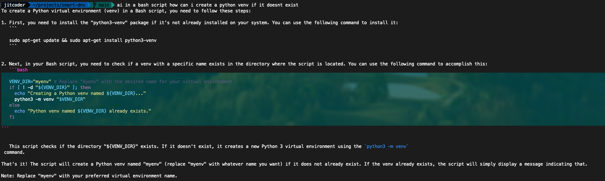

# AI Assist

Local running LLM in your cli to assist you with cli commands and coding questions (syntax highlighting).



usage:
```
$ ai whats the iptables command to list all rules
```

# Installation
  - install ollama
  - install python3
  - add to repo to path (.profile or .bashrc or .zshrc)
  - `ollama pull <model>` (search for models on https://ollama.com/)

I recommend using leaderboards to find a suitable model for yourself. Here are some that I use:

- https://huggingface.co/spaces/bigcode/bigcode-models-leaderboard
- https://huggingface.co/spaces/mike-ravkine/can-ai-code-results

```
export PATH=/path/to/repo:$PATH
```
